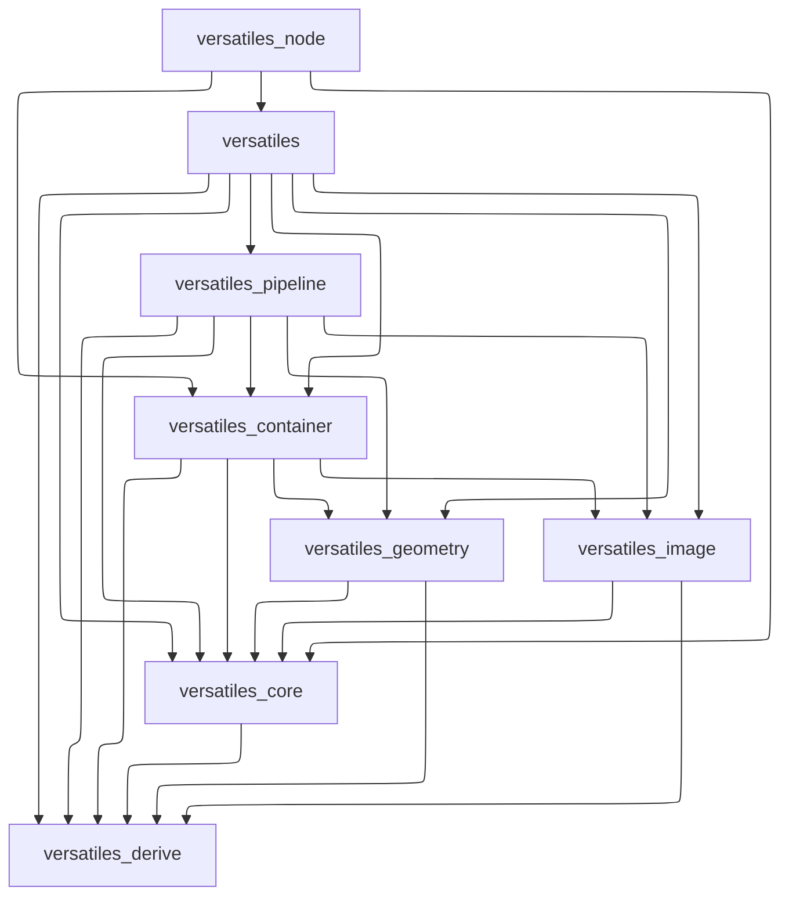

[](https://crates.io/crates/versatiles)
[](https://crates.io/crates/versatiles)
[](https://codecov.io/gh/versatiles-org/versatiles-rs)
[](https://github.com/versatiles-org/versatiles-rs/actions/workflows/ci.yml)
[](LICENSE)

# VersaTiles

VersaTiles is a Rust-based tool for processing and serving tile data efficiently. It supports multiple tile formats and offers functionalities for seamless tile handling.

---

## Table of Contents

- [Installation](#installation)
  - [Linux](#linux)
  - [MacOS](#macos)
  - [NixOS](#nixos)
  - [Docker](#docker)
  - [Building with Cargo](#building-with-cargo)
  - [Building from Source](#building-from-source)
- [Quick Start](#quick-start)
- [Usage](#usage)
  - [Core Concepts](#core-concepts)
  - [Commands](#commands)
  - [VersaTiles Pipeline Language](#versatiles-pipeline-language)
- [Configuration](#configuration)
- [GDAL support](#gdal-support)
- [Development](#development)
  - [Prerequisites](#prerequisites)
  - [Quick Start](#quick-start-1)
  - [Development Workflow](#development-workflow)
  - [Pre-commit Hooks (Recommended)](#pre-commit-hooks-recommended)
  - [Node.js Bindings Development](#nodejs-bindings-development)
  - [Release Process](#release-process)
  - [Contributing](#contributing)
- [Repository Structure](#repository-structure)
- [Using as a Library](#using-as-a-library)
- [Additional Information](#additional-information)
- [Contributing](#contributing)
- [License](#license)

---

## Installation

### Linux

Install VersaTiles using the provided [installation script](https://github.com/versatiles-org/versatiles-rs/blob/main/scripts/install-unix.sh) (that downloads the correct [precompiled binary](https://github.com/versatiles-org/versatiles-rs/releases/latest/)):

```sh
curl -Ls "https://github.com/versatiles-org/versatiles-rs/raw/main/scripts/install-unix.sh" | sudo sh
```

### MacOS

Install VersaTiles via [Homebrew](https://docs.versatiles.org/guides/install_versatiles#homebrew-for-macos):

```sh
brew tap versatiles-org/versatiles
brew install versatiles
```

### NixOS

VersaTiles is available via `nixpkgs` (starting from version 24.05):

[](https://repology.org/project/versatiles/versions)
[](https://repology.org/project/versatiles/versions)
[](https://repology.org/project/versatiles/versions)
[](https://repology.org/project/versatiles/versions)

Add this snippet to `configuration.nix`:

```nix
environment.systemPackages = with pkgs; [ versatiles ];
```

Alternatively, use it in a shell environment:

```nix
{ pkgs ? import <nixpkgs> {} }:

pkgs.mkShell {
  buildInputs = with pkgs; [ versatiles ];
}
```

Find more details on [Nix search](https://search.nixos.org/packages?show=versatiles).

### Docker

Pull the latest [Docker image](https://github.com/versatiles-org/versatiles-docker) for easy deployment:

```sh
docker pull versatiles-org/versatiles
```

### npm (Node.js)

Install the Node.js bindings for use in JavaScript/TypeScript projects:

```sh
npm install @versatiles/versatiles-rs
```

#### Prerelease Versions

Test upcoming features with prerelease tags:

```sh
# Alpha (bleeding edge)
npm install @versatiles/versatiles-rs@alpha

# Beta (feature complete, testing)
npm install @versatiles/versatiles-rs@beta

# Release Candidate (final testing)
npm install @versatiles/versatiles-rs@rc
```

See all available versions:
```sh
npm view @versatiles/versatiles-rs versions
```

### Building with Cargo

Ensure you have [Rust installed](https://doc.rust-lang.org/cargo/getting-started/installation.html), then run:

```sh
cargo install versatiles
```

### Building from Source

Clone the repository and build VersaTiles manually:

```sh
git clone https://github.com/versatiles-org/versatiles-rs.git
cd versatiles-rs
cargo build --bin versatiles --release
cp ./target/release/versatiles /usr/local/bin/
```

---

## Quick Start

Get started with VersaTiles in 3 steps:

### 1. Verify Installation

```sh
versatiles --version
```

### 2. Download Sample Data

```sh
# Download a small region (Berlin, ~60MB)
versatiles convert --bbox=13.0,52.3,13.8,52.7 --bbox-border=3 https://download.versatiles.org/osm.versatiles berlin.versatiles
```

### 3. Explore Your Data

```sh
# View tile information
versatiles probe berlin.versatiles

# Serve tiles locally
versatiles serve berlin.versatiles

# Access at http://localhost:8080
```

### Common Workflows

**Convert tile formats:**
```sh
versatiles convert input.mbtiles output.versatiles
```

**Filter by zoom level:**
```sh
versatiles convert --min-zoom=5 --max-zoom=12 input.versatiles output.versatiles
```

**Extract a region:**
```sh
versatiles convert --bbox=13.0,52.3,13.8,52.7 world.versatiles berlin.versatiles
```

---

## Usage

### Core Concepts

VersaTiles works with **tile containers** - files or directories containing map tiles organized by zoom level (z), column (x), and row (y).

**Supported formats:**
- `.versatiles` - Native format (best compression, fastest access)
- `.mbtiles` - SQLite-based (widely compatible)
- `.pmtiles` - Cloud-optimized single-file format
- `.tar` - Simple archive format
- Directories - Folder structure: `z/x/y.ext`

**Remote access:** VersaTiles can read remote `.versatiles` and `.pmtiles` files via HTTPS:
```sh
versatiles serve https://download.versatiles.org/osm.versatiles
```

### Commands

Run `versatiles` to see available commands:

```
Usage: versatiles [OPTIONS] <COMMAND>

Commands:
  convert  Convert between different tile containers
  probe    Show information about a tile container
  serve    Serve tiles via HTTP
  dev      Developer tools (unstable)
  help     Show detailed help
```

#### convert - Convert Between Tile Formats

Convert tiles between formats, filter by region or zoom, and transform coordinates.

**Basic conversion:**
```sh
versatiles convert input.mbtiles output.versatiles
```

**Advanced options:**

| Option | Description | Example |
|--------|-------------|---------|
| `--min-zoom`, `--max-zoom` | Filter zoom levels | `--min-zoom=5 --max-zoom=12` |
| `--bbox` | Extract region (lon_min,lat_min,lon_max,lat_max) | `--bbox=13.0,52.3,13.8,52.7` |
| `--bbox-border` | Add border tiles around bbox | `--bbox-border=3` |
| `--compress` | Set compression (gzip, brotli, zstd) | `--compress=brotli` |
| `--tile-format` | Convert tile format (png, jpg, webp, avif, pbf) | `--tile-format=webp` |
| `--swap-xy` | Swap X/Y coordinates (z/x/y → z/y/x) | `--swap-xy` |
| `--flip-y` | Flip tiles vertically | `--flip-y` |

**Real-world examples:**

```sh
# Extract city region from world tiles
versatiles convert --bbox=13.0,52.3,13.8,52.7 \
  world.versatiles berlin.versatiles

# Compress tiles with maximum compression
versatiles convert --compress=brotli \
  uncompressed.tar compressed.versatiles

# Convert image format for smaller file size
versatiles convert --tile-format=webp \
  tiles.mbtiles tiles-webp.versatiles

# Fix coordinate system (TMS to XYZ)
versatiles convert --flip-y \
  tms-tiles.mbtiles xyz-tiles.versatiles

# Remote conversion with zoom filtering
versatiles convert --min-zoom=1 --max-zoom=10 \
  https://download.versatiles.org/osm.versatiles \
  local-osm-filtered.versatiles
```

#### probe - Inspect Tile Containers

Analyze tile containers to understand their contents and structure.

**Basic usage:**
```sh
versatiles probe tiles.versatiles
```

**Depth levels:**

| Level | Flag | Scans | Use Case |
|-------|------|-------|----------|
| 1 | `-d` | Container metadata | Quick info (zoom range, tile format) |
| 2 | `-dd` | All tile coordinates | Find actual tile coverage |
| 3 | `-ddd` | Tile contents | Analyze tile sizes, validate data |

**Examples:**

```sh
# Quick metadata check
versatiles probe tiles.versatiles -d

# Find actual zoom range with tiles
versatiles probe tiles.versatiles -dd

# Deep inspection with tile statistics
versatiles probe tiles.versatiles -ddd

# Probe remote container
versatiles probe https://download.versatiles.org/osm.versatiles -d
```

#### serve - HTTP Tile Server

Run a local or production tile server with advanced configuration.

**Basic usage:**
```sh
versatiles serve tiles.versatiles
# Access at http://localhost:8080
```

**Server options:**

| Option | Description | Default |
|--------|-------------|---------|
| `-i, --ip` | Bind IP address | 0.0.0.0 |
| `-p, --port` | Port number | 8080 |
| `-c, --config` | YAML configuration file | - |
| `--minimal-recompression` | Fast serving (less compression) | false |
| `--disable-api` | Disable `/api` endpoints | false |

**Custom tile IDs:**

Assign custom IDs to tile sources using bracket or hash syntax:

```sh
# Bracket prefix: [id]source
versatiles serve [osm]tiles.versatiles

# Bracket suffix: source[id]
versatiles serve tiles.versatiles[osm]

# Hash syntax: source#id
versatiles serve tiles.versatiles#osm
```

Access tiles at: `http://localhost:8080/{id}/{z}/{x}/{y}.{ext}`

**Static content serving:**

```sh
# Serve tar archive at root
versatiles serve -s "static.tar.br" tiles.versatiles

# Serve with custom prefix
versatiles serve -s "[/assets]static.tar.gz" tiles.versatiles
# Access: http://localhost:8080/assets/...

# Multiple static sources (first match wins)
versatiles serve \
  -s "[/styles]styles.tar.br" \
  -s "[/fonts]fonts.tar.gz" \
  tiles.versatiles
```

**Supported static formats:** `.tar`, `.tar.gz`, `.tar.br`, directories

**Remote serving:**
```sh
# Serve remote tiles directly
versatiles serve https://download.versatiles.org/osm.versatiles

# Mix local and remote sources
versatiles serve \
  [local]local.versatiles \
  [osm]https://download.versatiles.org/osm.versatiles
```

**Configuration file:**

For production deployments, use YAML configuration (see [Configuration](#configuration) section):

```sh
versatiles serve -c production.yaml
```

For a full description of all configuration options:
```sh
versatiles help config
```

#### dev - Developer Tools (Unstable)

Experimental tools for tile analysis and debugging.

**measure-tile-sizes** - Generate a visual heatmap of tile sizes:

```sh
versatiles dev measure-tile-sizes tiles.versatiles output.png

# With options
versatiles dev measure-tile-sizes \
  --level=14 \
  --scale=4 \
  tiles.versatiles output.png
```

Output: PNG image where brightness = 10*log2(tile_size). Use to identify large tiles or data quality issues.

**export-outline** - Export tile coverage as GeoJSON:

```sh
versatiles dev export-outline tiles.versatiles coverage.geojson

# Specify zoom level (default: max zoom)
versatiles dev export-outline --level=10 tiles.versatiles coverage.geojson
```

Output: GeoJSON polygon showing which areas have tiles. Useful for visualizing coverage in QGIS/Mapbox.

**print-tilejson** - Print TileJSON metadata:

```sh
# Compact JSON
versatiles dev print-tilejson tiles.versatiles

# Pretty-printed JSON
versatiles dev print-tilejson -p tiles.versatiles
```

Output: Standard TileJSON 3.0.0 format with attribution, bounds, zoom levels, etc.

#### help - Detailed Help Topics

Get detailed help for specific topics:

```sh
# Pipeline language reference
versatiles help pipeline

# Configuration file reference
versatiles help config

# Raw markdown output (for documentation)
versatiles help pipeline --raw
```

### VersaTiles Pipeline Language

The VersaTiles Pipeline Language (VPL) allows you to define tile-processing pipelines. Operations include merging multiple tile sources, filtering, and modifying tile content.

**Example of combining multiple vector tile sources:**

```text
from_merged_vector [
   from_container filename="world.versatiles",
   from_container filename="europe.versatiles" | filter level_min=5,
   from_container filename="germany.versatiles"
]
```

More details can be found in [versatiles_pipeline/README.md](https://github.com/versatiles-org/versatiles-rs/blob/main/versatiles_pipeline/README.md).

---

## Configuration

For production deployments, use YAML configuration files for fine-grained control over the tile server.

### Basic Configuration

```yaml
server:
  ip: 0.0.0.0
  port: 8080
  minimal_recompression: false  # true = faster, larger responses
  disable_api: false             # true = disable /api endpoints

tiles:
  - name: osm
    src: "./tiles/osm.versatiles"
  - name: satellite
    src: "https://tiles.example.com/sat.versatiles"

static:
  - src: "./static"
    prefix: "/"
```

**Start with config:**
```sh
versatiles serve -c config.yaml
```

### Key Features

**CORS Configuration** - Control cross-origin access:

```yaml
cors:
  allowed_origins:
    - "https://example.org"          # Exact domain
    - "*.dev.example.org"            # Subdomain wildcard
    - "https://example.*"            # TLD wildcard
    - "/^https://.*\\.example\\.org$/" # Regex pattern
  max_age_seconds: 86400
```

**Custom Response Headers** - Add caching and CDN headers:

```yaml
extra_response_headers:
  Cache-Control: "public, max-age=86400, immutable"
  Surrogate-Control: "max-age=604800"      # For Varnish
  CDN-Cache-Control: "max-age=604800"      # For CDNs
```

**Multiple Tile Sources** - Serve multiple tile sets:

```yaml
tiles:
  # Local file
  - name: city
    src: "./city.versatiles"

  # Remote HTTPS
  - name: osm
    src: "https://download.versatiles.org/osm.versatiles"

  # MBTiles format
  - name: elevation
    src: "./terrain.mbtiles"

  # VPL pipeline (processed on-the-fly)
  - name: processed
    src: "./pipeline.vpl"
```

Access tiles at: `http://localhost:8080/{name}/{z}/{x}/{y}.{ext}`

**Static Content** - Serve styles, fonts, and sprites:

```yaml
static:
  # Tar archive at root
  - src: "./static.tar.br"
    prefix: "/"

  # Directory at custom path
  - src: "./public"
    prefix: "/assets"
```

Supported formats: directories, `.tar`, `.tar.gz`, `.tar.br`

### Complete Example

```yaml
server:
  ip: 0.0.0.0
  port: 8080
  minimal_recompression: false

cors:
  allowed_origins:
    - "https://myapp.com"
    - "*.myapp.dev"
  max_age_seconds: 86400

extra_response_headers:
  Cache-Control: "public, max-age=86400"

tiles:
  - name: basemap
    src: "https://download.versatiles.org/osm.versatiles"
  - name: satellite
    src: "./satellite.mbtiles"

static:
  - src: "./styles.tar.br"
    prefix: "/styles"
  - src: "./fonts.tar.gz"
    prefix: "/fonts"
```

### Full Reference

For complete configuration documentation, see:
- [versatiles/CONFIG.md](https://github.com/versatiles-org/versatiles-rs/blob/main/versatiles/CONFIG.md) - Full reference (auto-generated)

Or run:
```sh
versatiles help config
```

---

## GDAL support

`versatiles` supports GDAL since v1.0.0. However, this is still experimental.

### Building with GDAL support

Due to the numerous combinations of operating systems, package managers and GDAL versions, we must streamline this ecosystem. If you require GDAL support, we recommend the following:
1. Build GDAL locally by running `./scripts/install-gdal.sh`. This will build and install GDAL in the subfolder `./.toolchain/gdal`
2. Build `versatiles` with the features `gdal` and `bindgen`. We recommend using the scripts `./scripts/build_debug.sh` and `./scripts/build_release.sh`.

---

## Development

VersaTiles is built with Rust and includes Node.js bindings (NAPI-RS).

### Prerequisites

**Required:**
- Rust 1.92+ ([installation](https://www.rust-lang.org/tools/install))
- Node.js 20+ (for Node.js bindings)

**Optional:**
- [Lefthook](https://github.com/evilmartians/lefthook) - Pre-commit hooks
- GDAL 3.x - For GDAL support ([build instructions](#building-with-gdal-support))

### Quick Start

```bash
# Clone repository
git clone https://github.com/versatiles-org/versatiles-rs.git
cd versatiles-rs

# Build debug version
cargo build --bin versatiles

# Run tests
cargo test

# Run binary
./target/debug/versatiles --version
```

### Development Workflow

#### Running All Checks

Verify code quality before committing:

```bash
./scripts/check.sh
```

This runs:
- **Rust:** formatting (rustfmt), linting (clippy), type-checking, tests, doc tests
- **Node.js:** formatting (Prettier), linting (ESLint), type-checking (TypeScript), tests (Vitest)

#### Quick Fixes

**Rust:**
```bash
# Auto-format
cargo fmt

# Auto-fix clippy warnings
cargo clippy --fix

# Run specific tests
cargo test raster_overscale
cargo test --package versatiles_pipeline
```

**Node.js:**
```bash
cd versatiles_node

# Auto-fix all issues
npm run fix

# Individual tasks
npm run format        # Prettier
npm run lint:fix      # ESLint auto-fix
npm run typecheck     # TypeScript check
npm test              # Vitest
```

#### Building

**Debug build (fast compilation, slow execution):**
```bash
cargo build --bin versatiles
# Output: ./target/debug/versatiles
```

**Release build (slow compilation, fast execution):**
```bash
cargo build --bin versatiles --release
# Output: ./target/release/versatiles
```

**With GDAL support:**
```bash
# Build GDAL first
./scripts/install-gdal.sh

# Build with GDAL features
./scripts/build_release.sh
```

#### Testing

```bash
# All tests
cargo test

# Specific package
cargo test --package versatiles_core
cargo test --package versatiles_pipeline

# Specific test
cargo test raster_overscale

# With output
cargo test -- --nocapture

# Ignored tests (long-running)
cargo test -- --ignored
```

#### Documentation

```bash
# Generate docs
cargo doc --no-deps --open

# Test docs
cargo test --doc
```

### Pre-commit Hooks (Recommended)

Install [Lefthook](https://github.com/evilmartians/lefthook) for automatic quality checks:

```bash
# macOS
brew install lefthook

# Linux
curl -fsSL https://raw.githubusercontent.com/evilmartians/lefthook/main/install.sh | sh

# Windows
scoop install lefthook

# Enable hooks
lefthook install
```

**Hook behavior:**
- **pre-commit:** Fast checks (formatting, basic linting)
- **pre-push:** Full checks (all tests, clippy, type-checking)

**Skip hooks when needed:**
```bash
# Skip pre-commit
LEFTHOOK=0 git commit -m "message"

# Skip pre-push
git push --no-verify
```

### Node.js Bindings Development

See [versatiles_node/CONTRIBUTING.md](versatiles_node/CONTRIBUTING.md) for detailed workflow.

**Quick reference:**

```bash
cd versatiles_node

# Install dependencies
npm install

# Build Rust bindings
npm run build

# Build debug (faster compilation)
npm run build:debug

# Run tests
npm test

# Full check before commit
npm run check
```

### Contributing

We welcome contributions! Please:

1. **Fork and create a feature branch:**
   ```bash
   git checkout -b feature/my-feature
   ```

2. **Make changes and test:**
   ```bash
   ./scripts/check.sh
   ```

3. **Commit with clear messages:**
   ```bash
   git commit -m "feat: add new feature"
   ```

4. **Push and create pull request:**
   ```bash
   git push origin feature/my-feature
   ```

**Commit message format:**
- `feat:` New feature
- `fix:` Bug fix
- `docs:` Documentation only
- `style:` Formatting, no code change
- `refactor:` Code restructuring
- `test:` Adding tests
- `chore:` Maintenance tasks

---

## Repository Structure

### Code

- **/versatiles/** - Main library and binary
- **/versatiles_container/** - Handles tile containers (`*.versatiles`, `*.mbtiles`, `*.pmtiles`, etc.)
- **/versatiles_core/** - Core data types and utilities
- **/versatiles_derive/** - Derive macros for the library
- **/versatiles_geometry/** - Handles geometric data (OSM, GeoJSON, vector tiles, etc.)
- **/versatiles_image/** - Manages image data (PNG, JPEG, WEBP)
- **/versatiles_pipeline/** - VersaTiles Pipeline for efficient tile processing

Dependencies of the versatiles packages:


### Helpers

- **/docker/** - Dockerfile for Linux builds
- **/scripts/** - Scripts for checking, building, testing, and releasing
- **/testdata/** - Test files for validation

---

## Using as a Library

VersaTiles can be used as a command-line tool or integrated into Rust projects as a library. Check out [crates.io](https://crates.io/crates/versatiles) and [docs.rs](https://docs.rs/versatiles/latest/versatiles/) for more details.

---

## Additional Information

For advanced usage, guides, and detailed documentation, visit the [official documentation](https://docs.versatiles.org/).

---

## For Maintainers

### Creating a Release

See [RELEASING.md](./RELEASING.md) for the complete release process.

Quick version:
```bash
# Interactive mode - select release type from menu
./scripts/release-package.sh

# Or use command-line argument
./scripts/release-package.sh patch  # or minor/major/alpha/beta/rc/dev

# Push to trigger automated release
git push origin main --follow-tags
```

The GitHub Actions workflow will automatically:
- Build CLI binaries for 8 platforms (Linux gnu/musl x64/arm64, macOS x64/arm64, Windows x64/arm64)
- Build NAPI-RS bindings for Node.js (8 platform-specific packages)
- Publish to npmjs.com (@versatiles/versatiles-rs + 8 platform-specific packages)
- Create GitHub release with CLI binaries
- Trigger Docker and Homebrew updates

---

## Contributing

VersaTiles is actively developed, and contributions are welcome! If you find bugs, need features, or want to contribute, please check the [GitHub repository](https://github.com/versatiles-org/versatiles-rs) and submit an issue or pull request.

---

## License

This project is licensed under the MIT License. See the [LICENSE](LICENSE) file for details.
