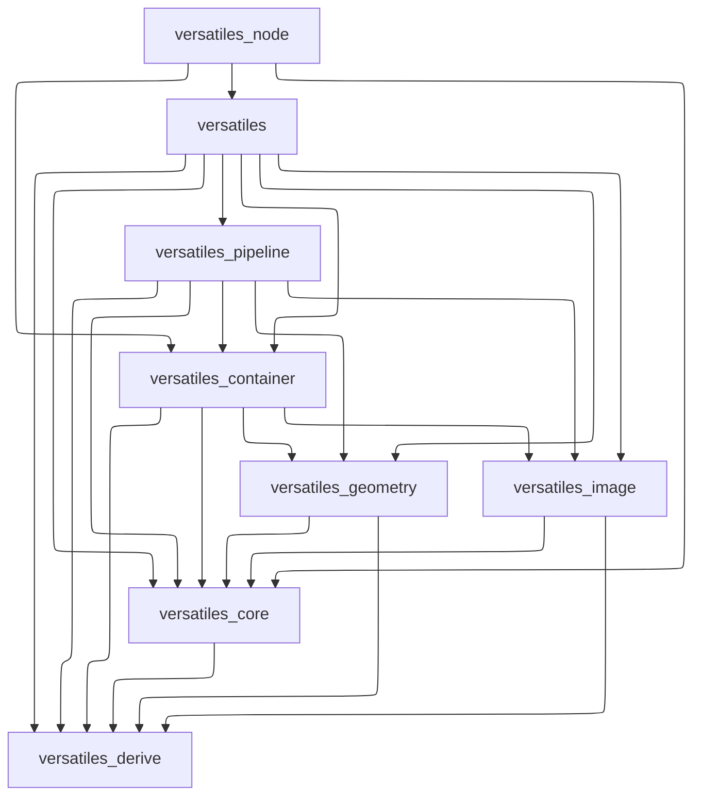

[](https://crates.io/crates/versatiles)
[](https://crates.io/crates/versatiles)
[](https://codecov.io/gh/versatiles-org/versatiles-rs)
[](https://github.com/versatiles-org/versatiles-rs/actions/workflows/ci.yml)
[](LICENSE)

# VersaTiles

VersaTiles is a Rust-based tool for processing and serving tile data efficiently. It supports multiple tile formats and offers functionalities for seamless tile handling.

---

## Table of Contents

- [Installation](#installation)
  - [Linux](#linux)
  - [MacOS](#macos)
  - [NixOS](#nixos)
  - [Docker](#docker)
  - [Building with Cargo](#building-with-cargo)
  - [Building from Source](#building-from-source)
- [Quick Start](#quick-start)
- [Usage](#usage)
  - [Convert Tiles](#convert-tiles)
  - [Serve Tiles](#serve-tiles)
  - [VersaTiles Pipeline Language](#versatiles-pipeline-language)
- [GDAL support](#gdal-support)
- [Development](#development)
  - [Running All Checks](#running-all-checks)
  - [Quick Fixes](#quick-fixes)
  - [Pre-commit Hooks (Recommended)](#pre-commit-hooks-recommended)
  - [More Information](#more-information)
- [Repository Structure](#repository-structure)
- [Using as a Library](#using-as-a-library)
- [Additional Information](#additional-information)
- [Contributing](#contributing)
- [License](#license)

---

## Installation

### Linux

Install VersaTiles using the provided [installation script](https://github.com/versatiles-org/versatiles-rs/blob/main/scripts/install-unix.sh) (that downloads the correct [precompiled binary](https://github.com/versatiles-org/versatiles-rs/releases/latest/)):

```sh
curl -Ls "https://github.com/versatiles-org/versatiles-rs/raw/main/scripts/install-unix.sh" | sudo sh
```

### MacOS

Install VersaTiles via [Homebrew](https://docs.versatiles.org/guides/install_versatiles#homebrew-for-macos):

```sh
brew tap versatiles-org/versatiles
brew install versatiles
```

### NixOS

VersaTiles is available via `nixpkgs` (starting from version 24.05):

[](https://repology.org/project/versatiles/versions)
[](https://repology.org/project/versatiles/versions)
[](https://repology.org/project/versatiles/versions)
[](https://repology.org/project/versatiles/versions)

Add this snippet to `configuration.nix`:

```nix
environment.systemPackages = with pkgs; [ versatiles ];
```

Alternatively, use it in a shell environment:

```nix
{ pkgs ? import <nixpkgs> {} }:

pkgs.mkShell {
  buildInputs = with pkgs; [ versatiles ];
}
```

Find more details on [Nix search](https://search.nixos.org/packages?show=versatiles).

### Docker

Pull the latest [Docker image](https://github.com/versatiles-org/versatiles-docker) for easy deployment:

```sh
docker pull versatiles-org/versatiles
```

### npm (Node.js)

Install the Node.js bindings for use in JavaScript/TypeScript projects:

```sh
npm install @versatiles/versatiles-rs
```

#### Prerelease Versions

Test upcoming features with prerelease tags:

```sh
# Alpha (bleeding edge)
npm install @versatiles/versatiles-rs@alpha

# Beta (feature complete, testing)
npm install @versatiles/versatiles-rs@beta

# Release Candidate (final testing)
npm install @versatiles/versatiles-rs@rc
```

See all available versions:
```sh
npm view @versatiles/versatiles-rs versions
```

### Building with Cargo

Ensure you have [Rust installed](https://doc.rust-lang.org/cargo/getting-started/installation.html), then run:

```sh
cargo install versatiles
```

### Building from Source

Clone the repository and build VersaTiles manually:

```sh
git clone https://github.com/versatiles-org/versatiles-rs.git
cd versatiles-rs
cargo build --bin versatiles --release
cp ./target/release/versatiles /usr/local/bin/
```

---

## Quick Start

Get started with VersaTiles in 3 steps:

### 1. Verify Installation

```sh
versatiles --version
```

### 2. Download Sample Data

```sh
# Download a small region (Berlin, ~60MB)
versatiles convert --bbox=13.0,52.3,13.8,52.7 --bbox-border=3 https://download.versatiles.org/osm.versatiles berlin.versatiles
```

### 3. Explore Your Data

```sh
# View tile information
versatiles probe berlin.versatiles

# Serve tiles locally
versatiles serve berlin.versatiles

# Access at http://localhost:8080
```

### Common Workflows

**Convert tile formats:**
```sh
versatiles convert input.mbtiles output.versatiles
```

**Filter by zoom level:**
```sh
versatiles convert --min-zoom=5 --max-zoom=12 input.versatiles output.versatiles
```

**Extract a region:**
```sh
versatiles convert --bbox=13.0,52.3,13.8,52.7 world.versatiles berlin.versatiles
```

---

## Usage

Run `versatiles` to see available commands:

```
Usage: versatiles [OPTIONS] <COMMAND>

Commands:
  convert  Convert between different tile containers
  probe    Show information about a tile container
  serve    Serve tiles via HTTP
  help     Show detailed help
```

### Convert Tiles

Convert between different tile formats, e.g. from `*.tar` to `*.versatiles`:

```sh
versatiles convert satellite_tiles.tar satellite_tiles.versatiles
```

### Serve Tiles

You can run a local HTTP server to serve your tile data:

```sh
versatiles serve satellite_tiles.versatiles
```

By default, this starts a simple HTTP server that serves the tiles from the specified container file.

You can also configure the server using a YAML configuration file:
```sh
versatiles serve -c config.yaml
```

This allows you to define multiple tile sources, set custom CORS headers, enable compression, and fine-tune server behavior.

For a full description of all configuration options, see the [configuration reference](https://github.com/versatiles-org/versatiles-rs/blob/main/versatiles/config.md) or run:
```sh
versatiles help config
```

### VersaTiles Pipeline Language

The VersaTiles Pipeline Language (VPL) allows you to define tile-processing pipelines. Operations include merging multiple tile sources, filtering, and modifying tile content.

Example of combining multiple vector tile sources:

```text
from_merged_vector [
   from_container filename="world.versatiles",
   from_container filename="europe.versatiles" | filter level_min=5,
   from_container filename="germany.versatiles"
]
```

More details can be found in [versatiles_pipeline/README.md](https://github.com/versatiles-org/versatiles-rs/blob/main/versatiles_pipeline/README.md).

---

## GDAL support

`versatiles` supports GDAL since v1.0.0. However, this is still experimental.

### Building with GDAL support

Due to the numerous combinations of operating systems, package managers and GDAL versions, we must streamline this ecosystem. If you require GDAL support, we recommend the following:
1. Build GDAL locally by running `./scripts/install-gdal.sh`. This will build and install GDAL in the subfolder `./.toolchain/gdal`
2. Build `versatiles` with the features `gdal` and `bindgen`. We recommend using the scripts `./scripts/build_debug.sh` and `./scripts/build_release.sh`.

---

## Development

### Running All Checks

To verify code quality before committing, run:

```bash
./scripts/check.sh
```

This runs all checks for both Rust and Node.js code:
- Rust: formatting, linting (clippy), type-checking, tests, documentation
- Node.js: formatting (Prettier), linting (ESLint), type-checking (TypeScript), tests

### Quick Fixes

**Auto-fix Rust code:**
```bash
cargo fmt
```

**Auto-fix Node.js code:**
```bash
cd versatiles_node
npm run fix  # Runs lint:fix and format
```

### Pre-commit Hooks (Recommended)

Install [Lefthook](https://github.com/evilmartians/lefthook) for automatic quality checks:

```bash
# macOS
brew install lefthook

# Enable hooks
lefthook install
```

This runs fast checks before commits and full checks before pushes, catching issues early.

### More Information

- **Node.js bindings**: See [versatiles_node/CONTRIBUTING.md](versatiles_node/CONTRIBUTING.md) for detailed development workflow
- **Quick reference**: See [DEVELOPMENT.md](DEVELOPMENT.md) for common commands

---

## Repository Structure

### Code

- **/versatiles/** - Main library and binary
- **/versatiles_container/** - Handles tile containers (`*.versatiles`, `*.mbtiles`, `*.pmtiles`, etc.)
- **/versatiles_core/** - Core data types and utilities
- **/versatiles_derive/** - Derive macros for the library
- **/versatiles_geometry/** - Handles geometric data (OSM, GeoJSON, vector tiles, etc.)
- **/versatiles_image/** - Manages image data (PNG, JPEG, WEBP)
- **/versatiles_pipeline/** - VersaTiles Pipeline for efficient tile processing

Dependencies of the versatiles packages:


### Helpers

- **/docker/** - Dockerfile for Linux builds
- **/scripts/** - Scripts for checking, building, testing, and releasing
- **/testdata/** - Test files for validation

---

## Using as a Library

VersaTiles can be used as a command-line tool or integrated into Rust projects as a library. Check out [crates.io](https://crates.io/crates/versatiles) and [docs.rs](https://docs.rs/versatiles/latest/versatiles/) for more details.

---

## Additional Information

For advanced usage, guides, and detailed documentation, visit the [official documentation](https://docs.versatiles.org/).

---

## For Maintainers

### Creating a Release

See [RELEASING.md](./RELEASING.md) for the complete release process.

Quick version:
```bash
# Interactive mode - select release type from menu
./scripts/release-package.sh

# Or use command-line argument
./scripts/release-package.sh patch  # or minor/major/alpha/beta/rc/dev

# Push to trigger automated release
git push origin main --follow-tags
```

The GitHub Actions workflow will automatically:
- Build CLI binaries for 8 platforms (Linux gnu/musl x64/arm64, macOS x64/arm64, Windows x64/arm64)
- Build NAPI-RS bindings for Node.js (8 platform-specific packages)
- Publish to npmjs.com (@versatiles/versatiles-rs + 8 platform-specific packages)
- Create GitHub release with CLI binaries
- Trigger Docker and Homebrew updates

---

## Contributing

VersaTiles is actively developed, and contributions are welcome! If you find bugs, need features, or want to contribute, please check the [GitHub repository](https://github.com/versatiles-org/versatiles-rs) and submit an issue or pull request.

---

## License

This project is licensed under the MIT License. See the [LICENSE](LICENSE) file for details.
